<div align="center">



<br/>

[](https://git.io/typing-svg)

<br/>


[](https://github.com/manthanawaya)

</div>

---

## `> whoami`

```
┌─────────────────────────────────────────────────────────────────┐
│  Name     →  Manthan Awaya                                      │
│  Role     →  B.Tech CS Student @ VIT Bhopal                    │
│  Building →  AI tools, web apps, DSA solutions                  │
│  Status   →  Open to collabs, hackathons & internships 🔥       │
│  Contact  →  manthanawaya@gmail.com                             │
└─────────────────────────────────────────────────────────────────┘
```

---

## ⚡ Tech Stack

<div align="center">


<br/><br/>


</div>

---

## 🏗️ What I've Built

<table>
<tr>
<td width="33%" valign="top">

### 🛡️ Grade-Guard
> **Predictive Grading Engine**

Tired of not knowing your relative grade? Built a Python tool that calculates exact academic standing using weighted assessments.

`Python` · `Data Analysis` · `Algorithms`

</td>
<td width="33%" valign="top">

### 🤖 SafeSpace AI
> **Hackathon Project**

Browser extension shielding users from harmful digital content in real-time. Built end-to-end under hackathon pressure.

`AI/ML` · `Browser Extension` · `NLP`

</td>
<td width="33%" valign="top">

### 📄 AI Resume Screener
> **Recruitment Automation**

Automated JD-vs-resume matcher that cuts recruiter screening time. Parses, scores and ranks candidates intelligently.

`Python` · `NLP` · `Automation`

</td>
</tr>
</table>

---

## 📊 GitHub Stats


<p align="center">
  
  
</p>

<br/><br/>


</div>

---

## 🐍 Contribution Snake

## 🐍 Contribution Snake


---

## 🕹️ Life Outside Code

```python
while not_coding:
    if mood == "competitive":  go_play("online games 🎮")
    if mood == "active":       go_play("football ⚽")
    if mood == "chill":        watch("a show 🎥")
    if mood == "creative":     shoot("pictures 📸")
```

---

## 🤝 Let's Connect

<div align="center">

[](https://www.linkedin.com/in/manthan-awaya/)
[](mailto:manthanawaya@gmail.com)
[](https://www.instagram.com/manthan_awaya?igsh=MWhjc3Vib2ZnMmoxNg==)

<br/>


</div>
